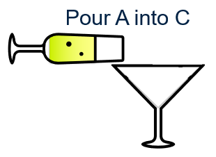

# progFunH5P
H5P Learning resources for programming fundamentals

Please help create and improve Creative Commons H5P learning resources for programming fundamentals.

For example, variableSwapping introduces sequencing required for variables swaps using a temp variable.

